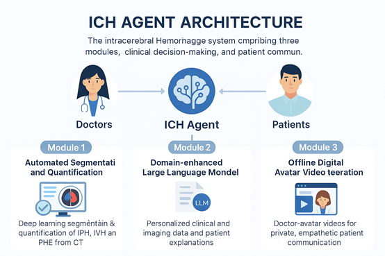
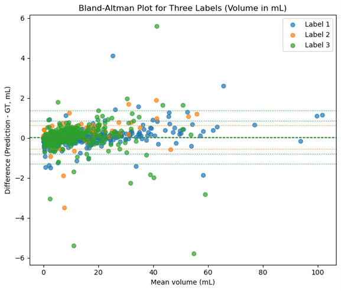

# **LLM-Driven Decision Support and Digital Avatar Patient Communication in Intracerebral Hemorrhage**


The code of our paper "[**LLM-Driven Decision Support and Digital Avatar Patient Communication in Intracerebral Hemorrhage**](https://thank.you)"

# Quick Links
+ [Overview](#overview)
+ [Deep Learning-Based Segmentation](#deep-learning-based-segmentation)
+ [Domain-Enhanced Large Language Model for Clinical Decision Support](#domain-enhanced-large-language-model-for-clinical-decision-support)
+ [Digital Avatar Video Synthesis](#digital-avatar-video-synthesis)
+ [Experiments](#experiments)


# Overview
<center>

</center>

In this work, we present the ICH Agent, an end-to-end artificial intelligence system that combines state-of-the-art automated CT-based segmentation, a domain-adapted large language model (LLM) for individualized clinical decision support, and an offline digital avatar platform for patient communication. Our objectives were: (1) to develop and validate a robust, automated segmentation pipeline for ICH, IVH, and PHE; (2) to enable personalized, evidence-based management recommendations using an LLM fine-tuned with contemporary guidelines and clinical trial evidence; and (3) to generate understandable textual explanations of disease status and management for patients and families through the LLM, which are subsequently transformed into clear, empathetic, and accessible physician-avatar videos. This integrated approach aims to enhance diagnostic accuracy, clinical workflow efficiency, and the quality of patient engagement in ICH care. You can find more details in our [paper](https://thank.you).

# Deep Learning-Based Segmentation

## nn-Unet V2

To set up the nn-Unet V2, you can run the following command:

``` bash
pip install nnunetv2
```

For more usage details, you can refer to [this](https://github.com/MIC-DKFZ/nnUNet?tab=readme-ov-file#how-to-get-started).

## MedNext 

To set up the MedNext, you can run the following command:

``` bash
git clone https://github.com/MIC-DKFZ/MedNeXt.git mednext
cd mednext
pip install -e .
```

For more usage details, you can refer to [this](https://github.com/MIC-DKFZ/MedNeXt?tab=readme-ov-file#usage-of-internal-training-pipeline).

## nnU-Net V2 with ChannelGate

Please replace `unet_decoder.py` of `dynamic_network_architectures` in `nn-Unet V2` with `src/unet_decoder.py`

#  Domain-Enhanced Large Language Model for Clinical Decision Support

## vLLM

To set up the dependencies, you can run the following command:

``` bash
pip install vLLM
```

vLLM can be deployed as a server that implements the OpenAI API protocol: 

```text-x-trilium-auto
vllm serve /path/to/Qwen3-30B-A3B --enable-reasoning --reasoning-parser deepseek_r1
```

To inference :

``` bash
python /src/infer_api.py
```

For more usage details, you can refer to [this](https://docs.vllm.ai/en/latest/).

# Digital Avatar Video Synthesis

## Heygem

Install the server:

```
cd /src/deploy_heygem
docker-compose -f docker-compose-linux.yml up -d
```

Install the client:

1. Directly download the Linux version of the [officially built installation package](https://github.com/GuijiAI/HeyGem.ai/releases).
2. Double click `HeyGem-x.x.x.AppImage` to launch it. No installation is required.

For more usage details, you can refer to [this](https://github.com/duixcom/Duix.Heygem?tab=readme-ov-file#3-how-to-run-locally).

# Experiments

<center>

</center>